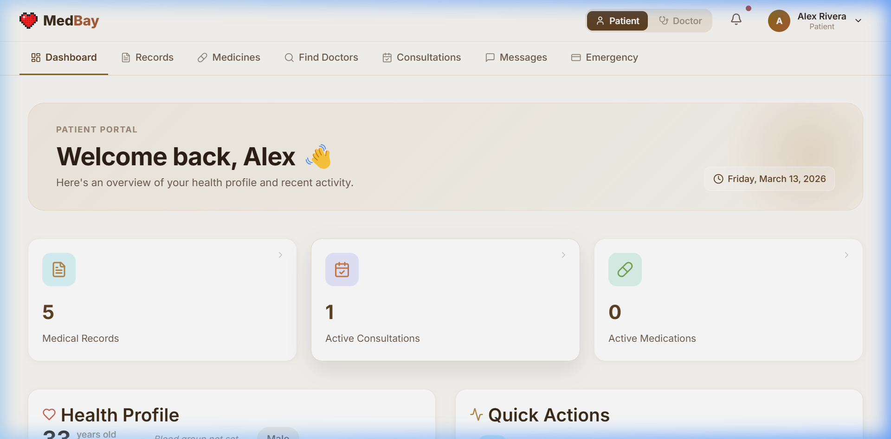
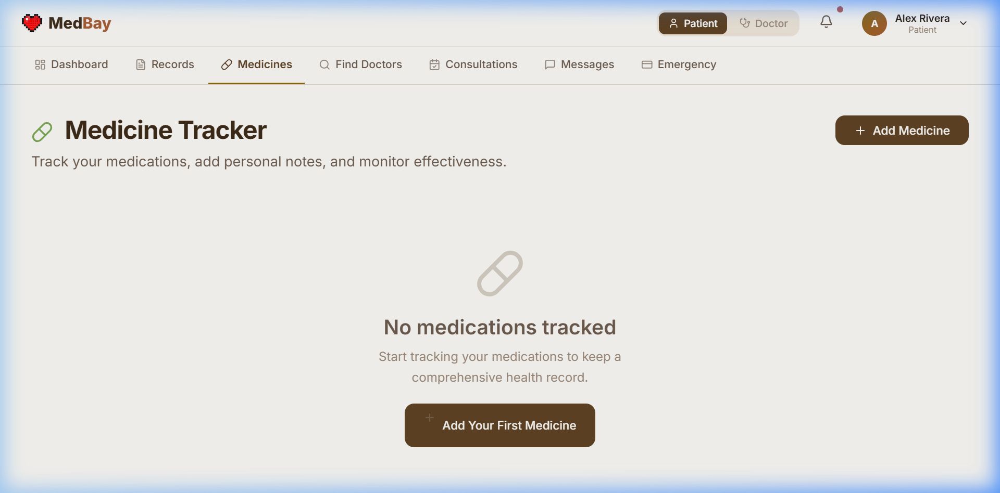
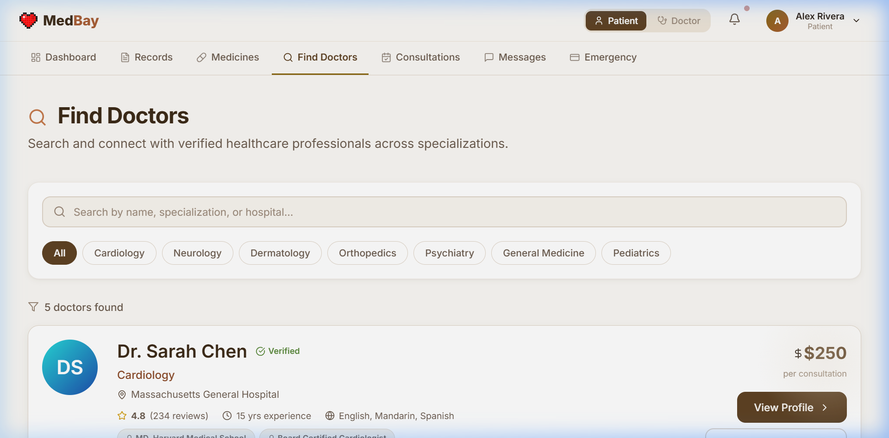
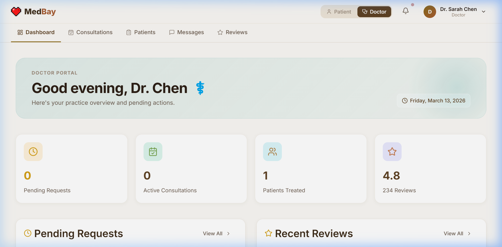

<div align="center">
  

  # 🩺 MedBay

  **A Modern, Secure, and Elegant Healthcare Platform**

  [](https://reactjs.org/)
  [](https://www.typescriptlang.org/)
  [](https://vitejs.dev/)
  [](https://firebase.google.com/)

</div>

---

## ✨ Overview

MedBay is a next-generation web application bridging the gap between healthcare professionals and patients. Built with a focus on **visual excellence**, **smooth interactions**, and **user privacy**, MedBay provides a warm, minimal, and highly professional portal for managing digital healthcare safely and seamlessly.

Say goodbye to clunky, clinical interfaces. MedBay introduces a **beautiful glassmorphism aesthetic**, **warm terracotta and beige tones**, and **smooth micro-animations** that make healthcare management feel like a premium experience.

---

## 📸 Screenshots

### Patient Portal
<div align="center">
  
  
</div>
<br />
<div align="center">
  
</div>

### Doctor Portal
<div align="center">
  
</div>

---

## 🚀 Key Features

### 🧑‍⚕️ For Patients
- **Personalised Dashboard**: A customized health hub with dynamic metrics, active prescriptions, and recent medical history timelines.
- **Find Specialists**: Browse, filter, and book appointments with verified doctors instantly.
- **Medicine Tracker**: Keep track of daily prescriptions and upcoming refills seamlessly.
- **Emergency Card**: A digital, secure layout combining your blood type, chronic conditions, and emergency contacts in one highly visible view.
- **Secure Messaging**: Private 1-on-1 end-to-end communication with your healthcare providers.

### 🩺 For Doctors
- **Practice Overview**: Real-time stats on pending requests, active consultations, and patient reviews.
- **Patient Records Access**: Securely view and update patient medical history (with explicit patient permission).
- **Schedule Management**: Accept, reject, or reschedule incoming consultation requests effortlessly.
- **Review System**: Build trust and reputation through verified patient feedback and ratings.

---

## 🎨 Design System

MedBay utilizes a bespoke design system avoiding generic template look-and-feel:
- **No Sidebars**: A modern, full-width 2-row sticky navigation bar that drops a shadow dynamically upon scroll.
- **Skeleton Loaders**: Polished shimmer loading states providing immediate feedback before data is seamlessly cross-faded in.
- **Depth & Hierarchy**: Replaced harsh borders with subtle, multi-layered box shadows (`box-shadow: 0 8px 24px rgba(45, 32, 22, 0.1)`) that give interactive elements a physical, floating feel.
- **Warm Themes**: Escaping the tired "hospital blue," MedBay embraces calm, warm aesthetics that prioritize user peace-of-mind.

---

## 🛠 Tech Stack

- **Frontend Framework**: [React 18](https://reactjs.org/)
- **Language**: [TypeScript](https://www.typescriptlang.org/)
- **Build Tool**: [Vite](https://vitejs.dev/)
- **Backend & Auth**: [Firebase (Authentication & Firestore)](https://firebase.google.com/)
- **Routing**: [React Router v6](https://reactrouter.com/)
- **Icons**: [Lucide React](https://lucide.dev/)
- **Styling**: Vanilla CSS (CSS Variables Design System)

---

## 📦 Getting Started

### Prerequisites
Make sure you have Node.js and NPM installed on your machine.

### Installation

1. **Clone the repository:**
   ```bash
   git clone https://github.com/wweeknd/MedBay.git
   cd MedBay
   ```

2. **Install dependencies:**
   ```bash
   npm install
   ```

3. **Set up Firebase:**
   Create a `.env.local` file in the root directory and add your Firebase configuration:
   ```env
   VITE_FIREBASE_API_KEY=your_api_key
   VITE_FIREBASE_AUTH_DOMAIN=your_auth_domain
   VITE_FIREBASE_PROJECT_ID=your_project_id
   VITE_FIREBASE_STORAGE_BUCKET=your_storage_bucket
   VITE_FIREBASE_MESSAGING_SENDER_ID=your_sender_id
   VITE_FIREBASE_APP_ID=your_app_id
   ```

4. **Run the development server:**
   ```bash
   npm run dev
   ```

5. **Open the app:**
   Navigate to `http://localhost:5173` in your browser.

---

## 🔒 Security & Privacy

Patient data security is absolutely critical. MedBay utilizes Firebase's robust security rules ensuring that:
- Patient medical records are strictly viewable only by the patient and explicitly authorized doctors.
- All communications are authenticated and secured.

---

<div align="center">
  <p>Designed and built with ❤️</p>
</div>
